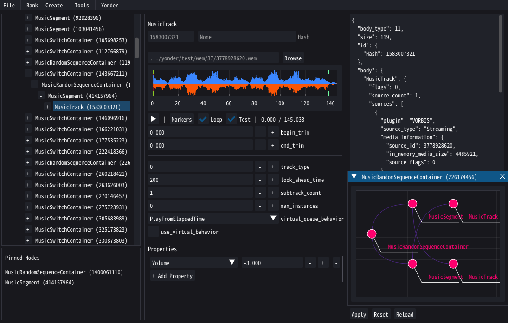

# The Misty Shores of Yonder
A tool for editing Wwise soundbanks, primarily developed for Elden Ring & Nightreign.

---

## Installation
While Yonder comes as a standalone app, it heavily relies on several other tools to do some of the heavy (binary) lifting. The first time one of these tools is needed, Yonder will ask you to locate the relevant executable. The tools in question are:

- [rewwise](https://github.com/vswarte/rewwise/releases): for unpacking/repacking soundbanks
- [vgmstream](https://github.com/vgmstream/vgmstream/releases): for converting .wem audio files to .wav
- [wwise](https://www.audiokinetic.com/en/download): for converting .wav files to .wem

## What can you do?
Yonder provides a comfortable way to make low- and medium-level edits. This includes:

- playback sounds and change loop/transition markers
- transfer sound hierarchies between soundbanks
- create entirely new event structures
- add boss music tracks and boss phase transitions
- add or remove sounds of existing events
- edit volume, low/high pass filter settings, etc.
- mass convert .wav files to .wem
- etc.

It is by no means as feature rich and exhaustive as wwise (and I don't think it will ever get there), but it makes a tedious and error prone task a lot more comfortable. 

## A Brief Lesson on Soundbanks
That really depends on what you want to do, so instead I'll give you a brief introduction on how soundbanks are structured. The most basic thing to do, of course, is opening a soundbank. For Elden Ring and co. you can find the soundbanks inside the game's `sd/` folder. Use [Nuxe](https://github.com/JKAnderson/Nuxe/releases) to unpack your game if you haven't done so already.

### Names & Hashes
When you open a soundbank, you will be presented with a tree view on the left, where ideally each node would have both a name and a unique ID - however, most nodes won't. This is a quirk of wwise: no node is ever referenced by it's name, they always use the [FNV-1 32bit hash](http://isthe.com/chongo/tech/comp/fnv/#FNV-1). As it is very difficult/time consuming to reverse a hash, we only know the proper names where we could somehow capture them from the game. In all other cases, Yonder will simply show `<?>` followed by the hash/ID,

Yonder already comes with a list of known names (based on the one used in `rewwise`). If you want to provide additional lists you can add them in the *Settings* menu. 

### Sound Structures
Everytime the game wants to play (or stop) a sound, let's say from an animation event, it will do so by asking wwise to activate an `Event`. These events have unique identifiers, e.g. `Play_s123456789` and will trigger one or more `Action`s. The most commonly used actions will activate or deactivate a sound structure, but there are also others that can e.g. change a state variable or mute a bus.

Sound structures are (usually) small tree graphs that control various aspects of playback. At the leafs you will typically find a `Sound` or `MusicTrack` which has a reference to the `.wem` file where the actual audio is stored (which is either packed with the soundbank or stored externally). For simple sounds these are parented to a `RandomSequenceContainer` which has settings for how to playback it's children (e.g. pick one at random for a weapon clank).

The top of these structures is what's typically activated/deactivated by an event action. However, these structures are also parented to a hierarchy of `ActorMixer` objects which manage how multiple structures behave when played in parallel. 

### Streamed Sounds
Soundbanks use (*afaik*) 3 kinds of audio sources: embedded, streamed, and prefetch-streamed. Most sounds, especially short ones, will be embedded. However, soundbanks have a size limit of around 89MB, so larger sounds like music tracks will typically be stored inside the soundbank.

- Embedded sounds are packed with the soundbank.
- Streamed sounds are placed outside the soundbank in a `wem` folder next to it.
- Prefetch-streamed sounds are placed outside the soundbank like streamed sounds. In addition, a very short snippet (the first 100 - 200ms) will be placed inside the soundbank so that it can be played immediately. This is often used for tightly timed sounds, like voice lines or some music tracks.

### Low-Level Edits
As you explore a soundbank you will probably find that some feature you want to edit is not exposed as a widget. In these cases you can always edit the *json* on the right by hand, then hit apply. There is no undo-function right now, but as long as you don't switch to another node you can hit *reset* to return the node to its previous state.

As mentioned before, Wwise is extremly powerful and has A LOT of features I am not even aware of. If you encounter something you find interesting, try searching for it in their [library](https://www.audiokinetic.com/en/public-library/) first. 

### Using your Modified Soundbank
Once you're happy with your edits you can save them. Yonder always works on the `soundbank.json` file you get from `rewwise`, so you'll have to repack it. To do so, simply click *File -> Repack* or F4. Be patient, this process can take several minutes, especially when editing a large soundbank like `cs_main`. It is easy to screw up a soundbank, especially when manually editing the json, so *watch out for errors on the terminal!* Once packed you can simply place it in your mod like any other mod file. Make sure however that you're using [ModEngine3](https://github.com/garyttierney/me3/releases) - ME2 won't load modded soundbanks (*).

## Building your own Tools
Yonder was originally written as a library providing classes and functions to make working with soundbanks more convenient. The GUI stuf was only added later, and I might at some point separate the two in a cleaner way. Still, if you want to use it to develop your own tools, just get the package and ignore the `gui` submodule. You also need the `resources` folder for node generation, hash lookups, etc.

To get started, I suggest you take a look at the code in [convenience.py](yonder/convenience.py) which will cover a lot of the functionality. The most central code parts can be found in the [soundbank.py](yonder/soundbank.py), [node.py](yonder/node.py), and [wem.py](yonder/wem.py) units. I did not add proper documentation (yet), so if you need help, feel free to reach out.

## Future Work
Yonder will probably never become my main project, so updates will be slow and irregular. There are a couple of things you may see in the future:

- music track clip editor
- create new ambience tracks
- setup RTPCs

If you have an earthshattering need for a particular feature in mind, it's best to create an issue here on Github. If that seems just slightly too much in the face of certain doom, feel free to contact me on the [?ServerName?](https://discord.gg/wzMynmW) discord *@Managarm*.

# Hall of Fame
This app would not have been possible without the invaluable help and support from **Raster** and **Vswarte**. A huge shoutout also goes to **Themyys** for his very helpful guide which got me into this mess, as well as **Shion** and others who did a lot of research I could build upon. 

Thanks! ~
