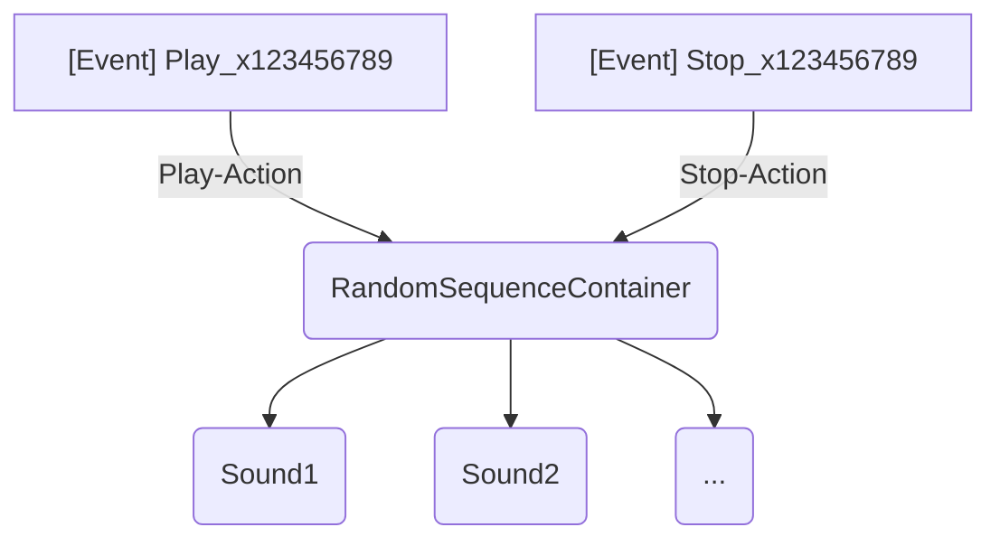

# Simple Sounds

Creates a simple one-shot sound structure. Based on the selected playback mode, sounds added will be either played back in sequence or at random. See [RandomSequenceContainers](../wwise/containers.md#random-sequence-container) for more details.
