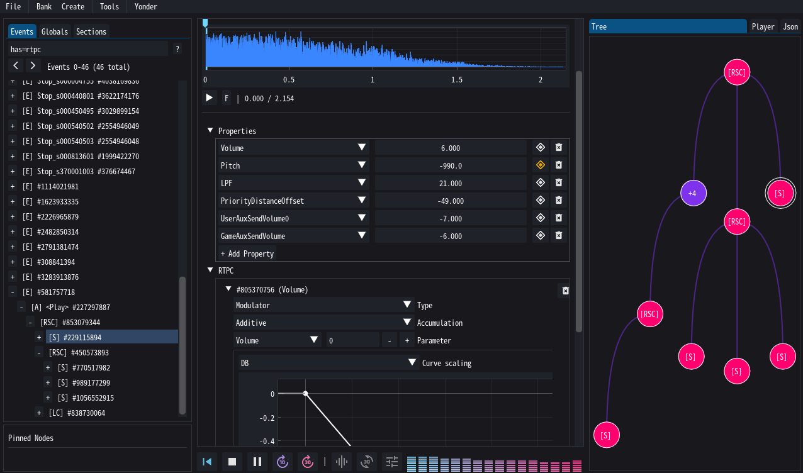

# What is Yonder?

Yonder is an app I wrote for editing [Audiokinetic Wwise](https://www.audiokinetic.com/en/wwise/) soundbanks - containers of complex audio graphs used to control audio audio playback, filtering and mixing in many modern games. It's also capable of simulating a large part of the audio playback. 

!!! warning 

    Yonder was specifically created for modding recent Fromsoft titles like *Elden Ring* and *Nightreign* and may thus not work well for other games. Please note that Dark Souls 3 and earlier titles used other engines like *fmod* which Yonder does not support.

## Soundbanks

A soundbank contains (part of) a large tree graph, where intermediate nodes are containers deciding which of their children to activate, wihle leaves define the audio sources to actually play (i.e. audio clips and music pieces). Each node can modify playback using static properties (e.g. volume, pitch, filters), automated curves (e.g. cross fades), and game-state dependent adjustments (e.g. distance-based attenuation). Playback is triggered from game events, and different branches will start and stop their children based on the current game state. 

Most of this will be explained in the [Wwise section](wwise/soundbanks.md). The rest of this site will be dedicated to what you can (and can't) do with [Yonder](yonder/howto.md), and how to do [this and that](guides/index.md).

!!! quote "But Mana, I can't possibly read all of this!"

    Yes, yes you can :face_with_raised_eyebrow: At the very least, read the pages I wrote about the various [node types](wwise/node_types.md) - *all of them* :knife:
