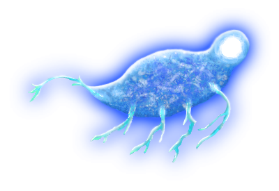

# The Misty Shores of Yonder

> The shore lies quiet, thick mists wrapping the jagged cliffs as if to hide them from heedful eyes. A lone seagull's cry pierces the silence, hailing from the clouded sky above, its perpetrator forever lost within the greyish expanse. Soon it wanes, yielding to the ocean's quiet murmer once again. Atop the highest cliff, the sheerest crag, the tallest rock that has yet to crumble, you stand idly and wait; waiting for your wandering mind to return from distant musings, and the trinkets it may bring with it. Perhaps, this time, it will bring a song.

{ align=right }
