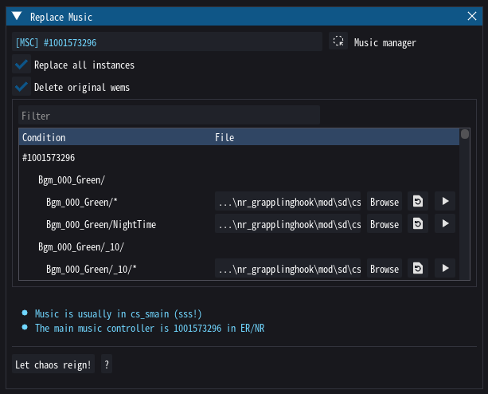

# Replacing Music

This tool allows you to easily replace certain music tracks. As described in [various](../guides/working_with_music.md) [places](../wwise/soundbanks.md), in Fromsoft games, music is typically stored in the `cs_smain` soundbank. Simply open it and go ham!

!!! warning

    Note that some songs are used in multiple places. By default, this tool will replace all instances, but this can be toggled from the options.
