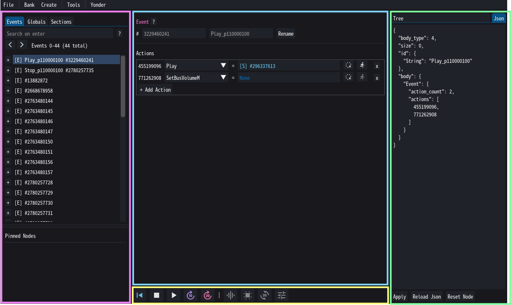

# How To Yonder

Yonder comes with [rewwise](https://github.com/vswarte/rewwise/releases) and [vgmstream](https://vgmstream.org/), which are the two programs you need for unpacking/repacking soundbanks and `wem` playback. On Linux you will have to find/compile binaries yourself, or get a bit creative with wine-wrappers. 

In order to convert wave-files and other audio formats to `wem` you also need to install [Wwise](https://www.audiokinetic.com/en/download). Unfortunately, there is no Linux-version available, and I'm not aware of any alternatives. [This tool](https://github.com/EtiTheSpirit/WEMConverter/) may work for you, but Fromsoft usually uses Vorbis-encoded wems.

## First Steps

To get those juicy soundbanks you'll first have to extract them from your game's archives. For Elden Ring and Nightreign this can be done using [Nuxe](https://github.com/JKAnderson/Nuxe). The soundbanks will be placed in the `Game/sd/` folder. Check the [soundbanks overview](../wwise/soundbanks.md#important-soundbanks) to get an idea of what lives where. Sit back and wait for the bank to load - large soundbanks like `cs_main` can take several minutes.

## What is What?

Yonder is organized in three panels - HIRC nodes on the left, node attributes in the center, utility stuff on the right.

The panel on the left will show you a list of [events](../wwise/events.md), [globals](../wwise/node_types.md#globals), and [bank sections](../wwise/soundbanks.md#sections). Under the events you will find a list of names and/or numbers, depending on whether the [hashes](hashes.md) are known. These nodes can be expanded to browse the rest of their associated hierarchy (see [node types](../wwise/node_types.md)). From the right-click context menu, nodes or entire subtrees can also be copied, reattached, and deleted.

The central panel's contents depend on the selected node, but will generally show the related parent and child nodes at the top, followed a swath of node-specific widgets. Note that any changes you make are applied to the node immediately.

!!! tip

    Made a change you didn't like? Yonder doesn't have a proper undo function yet; however, when switching to the *Json* panel on the right, you'll find a *Reset Node* button at the bottom. Click it and the node will be returned to the state it had the last time you selected it.

On the right you will see two tabs: a graph view, which can e used to quickly navigate the selected subtree, and a text panel with the node's attributes in `json` format. The latter can be used to modify attributes that are not exposed by Yonder as widgets (yet).

## Doing Things

Most soundbank edits will just come down to this: knowing what you want to do, and understanding how to use the various [node types](../wwise/node_types.md). That being said, Yonder includes various [tools](../tools/index.md) to make some common operations easier and setup Fromsoft-typical structures. More in-depth manual edits are covered in the [guides](../guides/index.md) section.

!!! tip

    Once you've made some edits you need to first **save** the soundbank (which writes your edits to the extracted `soundbank.json`), then **repack** it (which converts it back to a `.bnk`). Both of these actions can be triggered from the *File* menu - a backup will be created. *Always check the terminal output to see if there are any issues!*
