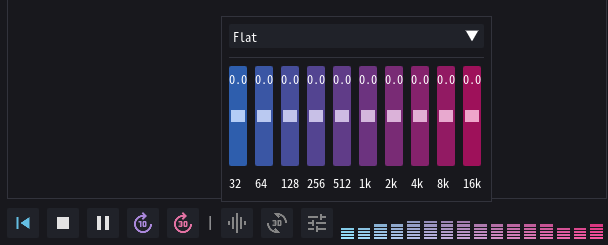
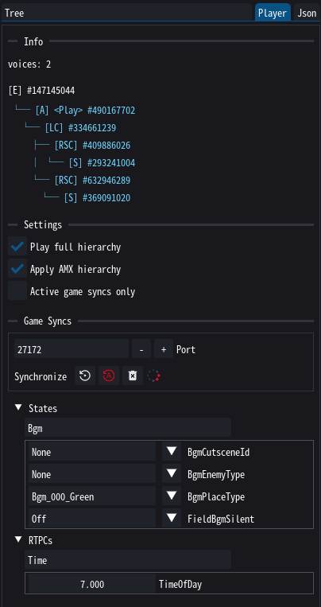

# Audio Playback

Yonder currently has two audio players: the legacy one works well, but only plays source nodes. Whenever you see a wave curve it's the legacy player being used. The HIRC player on the other hand plays entire hierarchies and simulates a large chunk of in-game audio playback, but is still new and might have a few bugs. They will probably be merged at some point.

!!! info

    Wwise stores its audio data in `.wem` files, which you can playback using [foobar2000](https://www.foobar2000.org/) with the [vgmstream decoder plugin](https://www.foobar2000.org/components/view/foo_input_vgmstream). Behind the curtains, Yonder uses the [vgmstream CLI](https://vgmstream.org/) to convert your wems for playback, too.

## The HIRC Player

Yonder now comes with a player widget that emulates part of the in-game playback. In particular, it will traverse the currently selected subtree, accumulate modifiers, and mix and play branches based on virtual game syncs. In particular you can control the following:

- global and per-voice volume
- frequency equalizer (game-specific presets will be added soon(tm))
- [game syncs](../wwise/game_syncs.md)
- listener distance and angle from the source

!!! tip

    If you don't hear anything, check the *Player* panel on the right. The player follows play/stop events and takes game syncs into account.

## Influencing Playback

{ align=right }

The *Player* panel on the right provides additional information on current playback and some settings. Of particular interest should be the game syncs section. This will list states and RTPCs that are used by the currently playing hierarchy (or any collected so far if the corresponding setting is toggled). If you have loaded the [Yonder live states dll](../downloads.md#read-game-syncs) into your game you can even query the game's current game syncs!

!!! tip "Why is there no section for switches?"

    Switches and states are functionally the same, except that one is set per game-object and the other globally. Since Yonder will only ever play one hierarchy there is no need to make a distinction (for now). Any switches read by the dll will be included in the states list and take precedence over states should states with the same names exist.

## What's Yet to Come

Some of this is still experimental and I'm not sure how far I can (or want to) take it. The following Wwise things are currently _not_ supported:

- effects (i.e. only the dry signal is processed)
- transition rules (except for fade durations)
- occlusion, obstruction, diffraction, transmission
- bus properties
- many container attributes that would probably be relevant...
